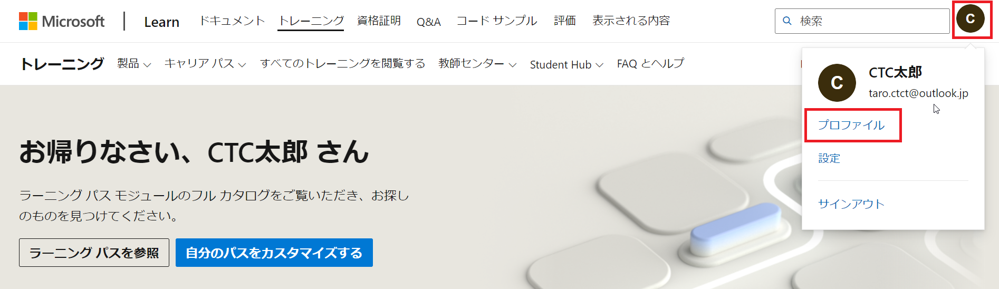
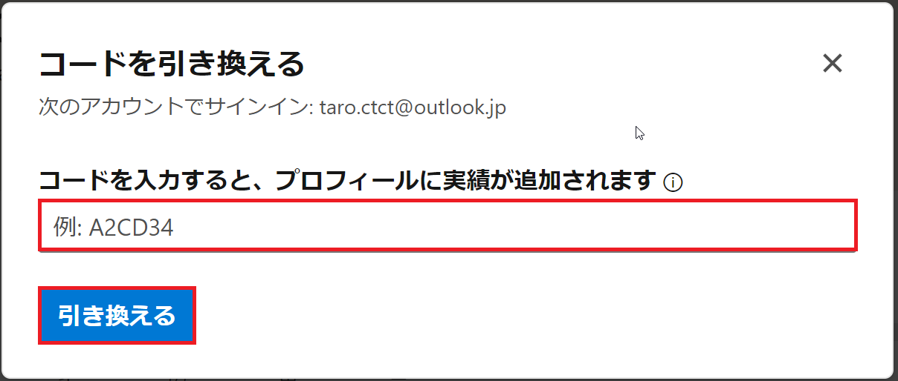
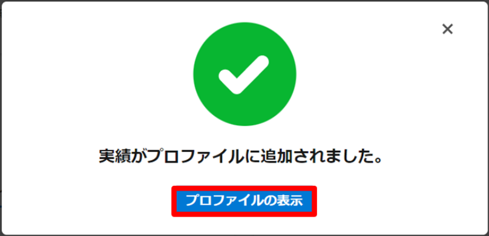

# CTC教育サービス

## Microsoft関連 コース ガイド

------

### ■はじめに

この度は、CTC教育サービス主催のMicrosoft認定コースへご参加いただき、誠にありがとうございます。

本コースは、Microsoft製品およびサービスに関する深い知識と実践的なスキルを習得していただくことを目的としています。

研修やセミナーを通じて、最新の技術動向やベストプラクティスを学び、業務での即戦力として活用できるスキルを身につけていただけます。

------

### ■アチーブメントコードについて

**研修やセミナーを修了された方には、弊社の講師またはスタッフよりアチーブメントコードをお渡しいたします。**

このコードをMicrosoft Learnにて引き換えていただくことで、受講したコースを学習履歴として保存することが可能です。

また、コードの引き換えと同時に、弊社の研修を何名の方が受講されたかがMicrosoft社へ通知されます。

**恐れ入りますが、受講後にはぜひコードの引き換えをお願いいたします。引き換え手順については、以下の説明をご参照ください。**

------

### ■アチーブメントコードの引き換え手順

**※事前に、Microsoftアカウントまたは組織アカウント（社内で使用しているMicrosoft 365アカウント）をご準備ください。**

1. Microsoft Learn (https://learn.microsoft.com/ja-jp/training/) へアクセスします。

    

2. 画面右上にある「サインイン」をクリックし、Microsoftアカウントまたは組織アカウントでサインインを行います。

   

   

3. サインイン後、画面右上のアイコンを選択し、「プロファイル」をクリックします。

   

   

4. 画面右にある「実績」をクリックします。

   

   

5. 「コードを今すぐ引き換えください」をクリックします。

   

   

6. 講師またはスピーカーから受け取ったアチーブメントコードを入力し、「引き換える」をクリックします。

   > ※アチーブメントコードは研修当日に配布します。

   

   

7. 「実績がプロファイルに追加されました」と表示されます。「プロファイルの表示」をクリックします。

   

   

8. もう一度、「実績」をクリックします。

   

   

9. 「モジュール」「ラーニング パス」「コース」のいずれかに、交換した日付でバッジやトロフィーが表示されたことを確認します。

   これで、アチーブメントコードのアクティベートと実績確認の作業が終わりました。

   > ※アクティベートには時間がかかる場合があります。バッジなど表示されない場合は、少し時間をおいて再読み込みしてください。

   

------

**これで全てのご案内は完了となります。お忙しい中、ご協力いただき誠にありがとうございました。**

**お手数をおかけしますが、引き続きご協力のほど何卒よろしくお願いいたします。**

**なお、ご不明点などがございましたら、研修またはセミナーの案内メールにご返信ください。**
